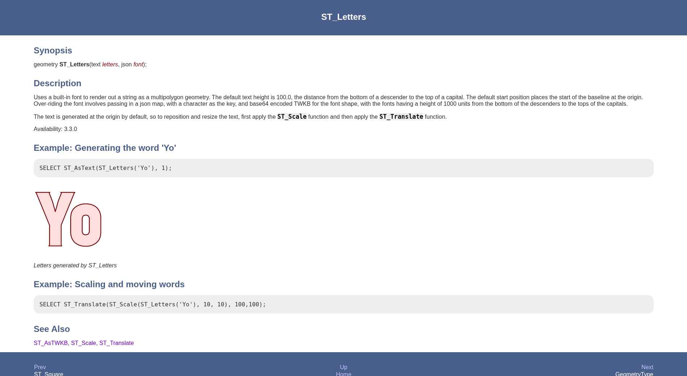
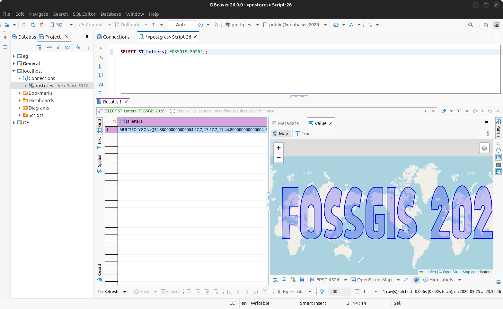
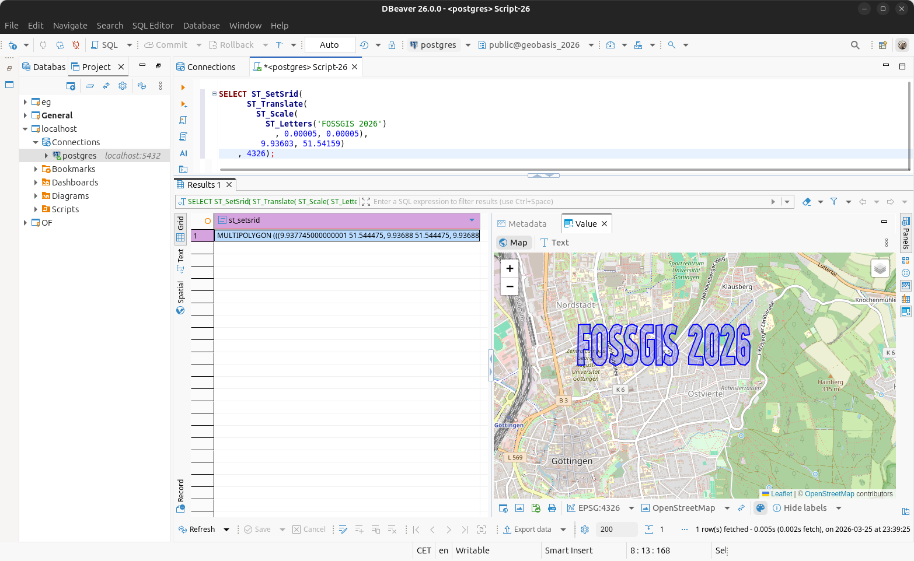
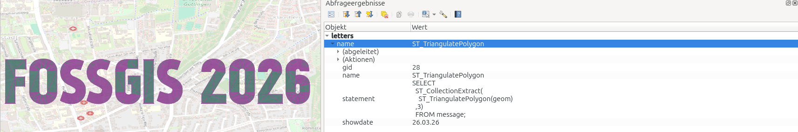
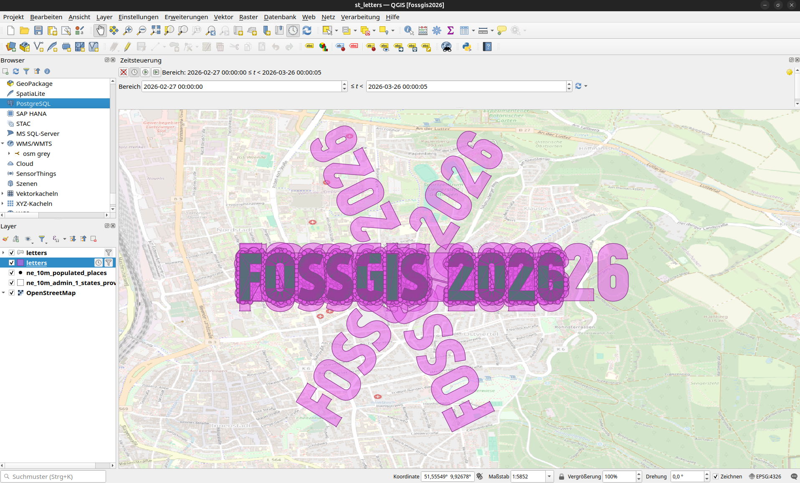
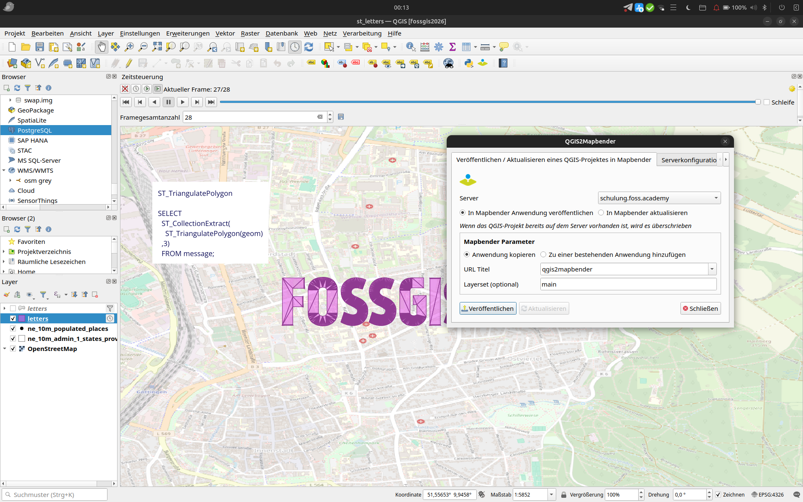
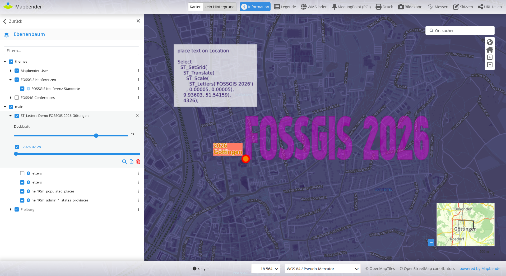

# PostGIS ST_Letters - Worte sagen manchmal mehr

[FOSSGIS 2026 Göttingen](https://www.fossgis-konferenz.de/2026/)

 

FOSSGIS Programm-Link: https://pretalx.com/fossgis2026/talk/AXWCQT/


[](https://creativecommons.org/licenses/by-sa/4.0/)


## Astrid Emde

* WhereGroup GmbH Germany
* https://www.wheregroup.com/
* astrid.emde@wheregroup.com
* [@astroidex fediverse](https://mastodon.social/@astroidex)


* FOSS Academy https://www.foss-academy.com/


## Warum ST_Letters? 
* PostGIS-Funktionen ohne Daten ausprobieren
* ST_Letters >= PostGIS 3.3.0
* Die Funktion erzeugt eine Zeichenkette als Multipolygon-Geometrie
* https://postgis.net/docs/ST_Letters.html




## Einfach ausprobieren

```sql
SELECT ST_Letters('FOSSGIS 2026');
```




## Text skalieren und nach Göttingen verschieben

* Die Standardtextgröße beträgt 100
* Bei der Standardstartposition liegt der Anfang der Grundlinie am Ursprung.

Und so geht's

* Text skalieren – mit ST_Scale wird der Text verkleinert
* Text verschieben – mit ST_Translate wird der Text nach Göttingen verschoben
* EPSG-Code zuweisen – mit ST_SetSrid wird der EPSG-Code 4326 zugewiesen


```sql
SELECT 
  ST_SetSrid(
    ST_Translate(
      ST_Scale(
        ST_Letters('FOSSGIS 2026')
      , 0.00005, 0.00005),
    17.787, 43.34603), 
    4326);
```




## Der Spaß beginnt - mit ST_Letters PostGIS-Funktionen entdecken

* Probieren Sie ST_Letters mit dem Demo-Skript aus
* Erstellen Sie eine Datenbank
* Aktivieren Sie die Erweiterung **postgis**
* Führen Sie **script/st_letters_demo.sql** in DBeaver, pgAdmin oder psql aus
* Sehen Sie sich Ihre Daten in QGIS an (probieren Sie das Demo-Projekt st_letters.qgz aus – aktualisieren Sie dazu Ihre .pg_service.conf)

So sieht die Tabelle aus

```sql
Create table letters (
  gid serial Primary Key,
  name varchar,
  statement varchar,
  geom geometry,
  showdate date
);
```




### QGIS




## Video

* und jetzt noch alles in einem Video

[](https://youtu.be/tJus7hJhJv4)


### QGIS Server WMS veröffentlichen und in Mapbender anzeigen







## Schritt für Schritt

* Erstellen Sie eine Demotabelle mit **script/st_letters_demo.sql**. Jedes Beispiel steht für einen Tag.
* QGIS-Projekt mit der **Zeitsteuerung (Temporal Controller)** für st_letters, um jeweils nur eine Demo anzuzeigen.
* Exportieren Sie Bilder über die **Zeitsteuerung (Temporal Controller)**
* Erstellen Sie ein Video mit ffmpeg
* Veröffentlichen Sie das QGIS-Projekt als QGIS Server WMS über das QGIS-Plugin QGIS2Mapbender
* Aktivieren Sie **Dimensions** für den WMS in Mapbender, um jeweils nur eine Demo anzuzeigen


## Auch interessant

* Fun with Letters in PostGIS 3.3! Jacob Coblentz Crunchy Data https://www.crunchydata.com/blog/fun-with-letters-in-postgis-33


### Viel Spaß mit ST_Letters & PostGIS!
